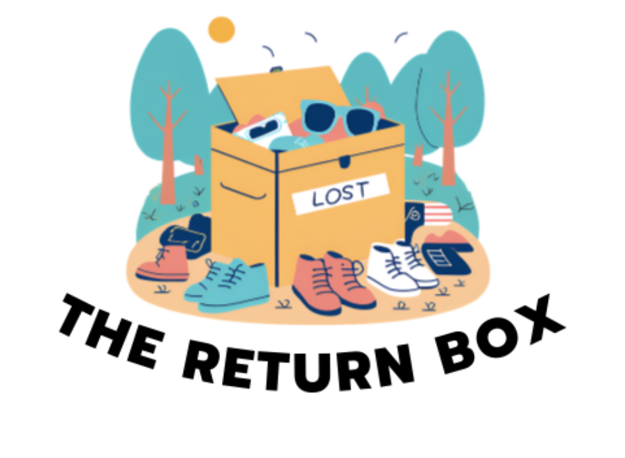
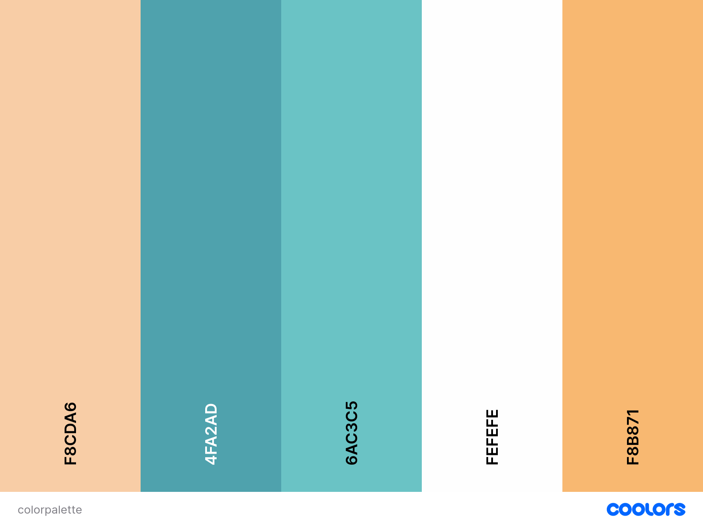

# **The Return Box**

#### The Return Box is an API service for organizing lost and found items. It tracks the items, locations of different Lost and Founds and the claims that are made on the items.

|                              COLOR PALETTE                               |                                                DEMO                                                |
| :----------------------------------------------------------------------: | :------------------------------------------------------------------------------------------------: |
|  | <video width=100% controls><source src="src/springdemovid.mkv" type="video/mp4">DEMO Video</video> |

## **KEY FEATURES:**

Control tables with built in functions from the API. Build a functional Lost and Found service with multiple locations.

Integrate SQL to store item, location, and claim information. Tables share relations to each other to accurately depict the status of different items.

## **HOW TO USE**

The API has built in functions for creation, SQL compatibility, relation and other functions for updating the information. Using these functions the API can be used to organize Lost and Found information.
